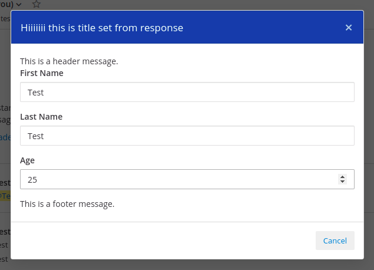

# Mattermost Plugin Dialog Example

This plugin serves as an example for writing a Mattermost plugin to open a custom modal.

## Open Modal API

Use the following sample API request using postman to open the relevant modal in the webapp.

`POST http://localhost:8065/plugins/com.brightscout.dialog.example/dialog`

```json
{
		"username": "test",
		"payload": {
			"title":"Hiiiiiii this is title set from response",
			"header": "This is a header message.",
			"form_fields": [
				{
					"label": "First Name",
					"id": "first_name",
					"type": "text"
				},
				{
					"label": "Last Name",
					"id": "last_name",
					"type": "text"
				},
				{
					"label": "Age",
					"id": "age",
					"type": "number"
				}
			],
			"footer": "This is a footer message."
		}
}
```



### API Schema

- **username**: The username of the user who should see the modal
- **title**: The title of the modal.
- **header**: The header text for the modal.
- **footer**: The footer text for the modal.
- **form_fields**: An array of form fields that act as the body of the modal.
  * **label**: The label of the form field.
  * **id**: A unique id for the field.
  * **type**: The input type (text, number etc.) of the field.

## Getting Started

Note that this project uses [Go modules](https://github.com/golang/go/wiki/Modules). Be sure to locate the project outside of `$GOPATH`.
To learn more about plugins, see [our plugin documentation](https://developers.mattermost.com/extend/plugins/).

Build your plugin:
```
make dist
```

This will produce a single plugin file (with support for multiple architectures) for upload to your Mattermost server:

```
dist/com.brightscout.dialog.example.tar.gz
```

## Development

To avoid having to manually install your plugin, build and deploy your plugin using one of the following options.

### Deploying with Local Mode

If your Mattermost server is running locally, you can enable [local mode](https://docs.mattermost.com/administration/mmctl-cli-tool.html#local-mode) to streamline deploying your plugin. Edit your server configuration as follows:

```json
{
    "ServiceSettings": {
        ...
        "EnableLocalMode": true,
        "LocalModeSocketLocation": "/var/tmp/mattermost_local.socket"
    }
}
```

and then deploy your plugin:
```
make deploy
```

You may also customize the Unix socket path:
```
export MM_LOCALSOCKETPATH=/var/tmp/alternate_local.socket
make deploy
```

If developing a plugin with a webapp, watch for changes and deploy those automatically:
```
export MM_SERVICESETTINGS_SITEURL=http://localhost:8065
export MM_ADMIN_TOKEN=j44acwd8obn78cdcx7koid4jkr
make watch
```

### Deploying with credentials

Alternatively, you can authenticate with the server's API with credentials:
```
export MM_SERVICESETTINGS_SITEURL=http://localhost:8065
export MM_ADMIN_USERNAME=admin
export MM_ADMIN_PASSWORD=password
make deploy
```

or with a [personal access token](https://docs.mattermost.com/developer/personal-access-tokens.html):
```
export MM_SERVICESETTINGS_SITEURL=http://localhost:8065
export MM_ADMIN_TOKEN=j44acwd8obn78cdcx7koid4jkr
make deploy
```
